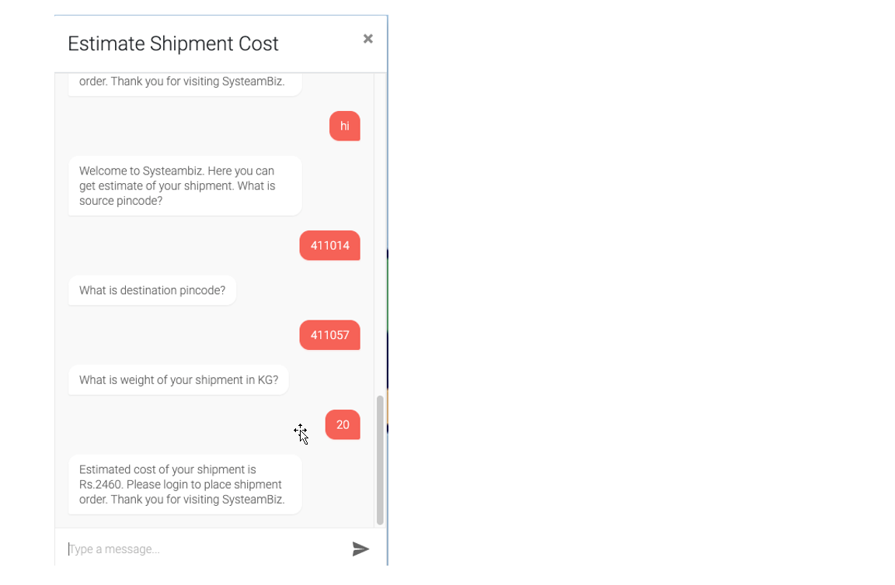

# systeam-user-interface
The repository for User Interface for SysteamBiz shipment solution.

- University Name: San Jose State University (http://www.sjsu.edu)
- Course: Cloud Technologies
- Professor: Sanjay Garje (https://www.linkedin.com/in/sanjaygarje)
- Students:
  - Praveen Kumar Thakur (https://www.linkedin.com/in/praveen-kumar-thakur-aa38301a)
  - Amit Vijapure (https://www.linkedin.com/in/amitvijapure)
  - Dhwani Shanghvi (https://www.linkedin.com/in/dhwani-sanghvi)
  - Jignesh Madhani (https://www.linkedin.com/in/jdmadhani)
  
### Project Introduction

  **In this project, we are going to provide two portals i.e. Customer portal and Vendor portal.**

  - **Customer Portal:** On this portal, customer can provide shipping details such as date, total weight, dimensions, source and destination pin codes. And using these details, system will provide best possible price. After that customer can confirm the order. Customer can also see the list of orders which they have placed.  

  - **Vendor Portal:** On this portal, vendors can provide shipping rates for a given source, destination and weight. Vendor can also see the list of orders.

### Architecture Diagram:
  

### Sample Demo Screenshots
  - Get Estimate
  
  

  - Place Order
  
  
  - Order List
  
  
  - Least shipment price
  
  
  - Update Price
  
  
  - Chatbot
  
  
  
### Pre-requisites Set-up
  - AWS S3
  - AWS Cloudfront
  - AWS Route53  
  
### List of required software to download locally
  - Node v10.16.3
  - NPM v6.9.0  
     
### How to set up and run project locally?
  - Run following command to install node modules:    
    *npm install*
  - Run following command to launch UI:    
    *npm start*